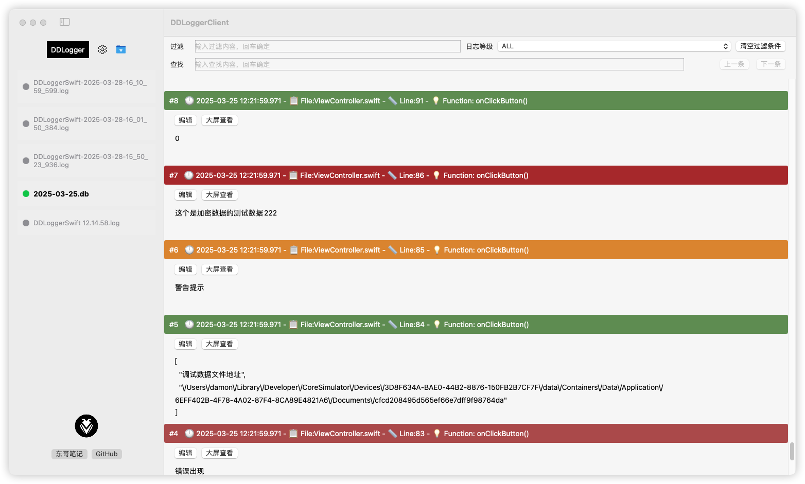

# DDLoggerClient  

    

  

### [中文文档](https://dongge.org/blog/1380.html)

This client is designed to conveniently view the log files generated by the iOS debugging log library [DDLoggerSwift](https://github.com/DamonHu/DDLoggerSwift).  

[DDLoggerSwift](https://github.com/DamonHu/DDLoggerSwift) stores log data using SQLite. While general SQLite viewing tools can display logs, they do so in a table format, often one log entry at a time, and some require payment. This tool was developed to provide a more intuitive and convenient way to browse and analyze logs.  

## **Key Features**  

- Developed natively with SwiftUI for superior performance.
- View `.db` and `.log` files with lightning-fast loading for large logs  
- Automatically parse log levels, timestamps, and file call stacks  
- Content filtering & log level filtering  
- Content search and copy functionality  
- Cross-file log bookmarking and search  
- Independent window management for viewing and editing logs  
- Decrypt encrypted logs from DDLoggerSwift  

## **Download the Client**  

Visit [Releases](https://github.com/DamonHu/DDLoggerClient/releases) to download the `dmg` file from the `Release` section. Drag and drop it into the Applications folder to install.  

## **Viewing Logs**  

Drag the `.db` file generated by `DDLoggerSwift` or a `.log` file exported via sharing into the left sidebar. The logs will be automatically parsed and displayed with appropriate colors based on log type, enabling easy filtering and searching.  

## **Client Configuration**  

If the decryption values `privacyLogPassword` and `privacyLogIv` have been modified on the mobile client, update them accordingly in the Mac client settings to ensure proper connection and decryption. If they are not synchronized, connection errors or decryption failures may occur.  

## **License**  

This project is licensed under the MIT License, allowing free modification and use.